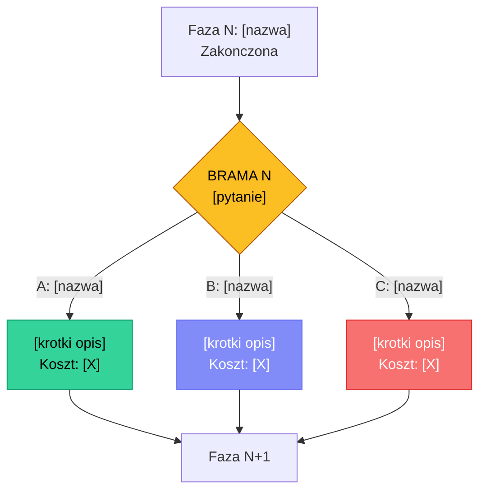

<!-- REFERENCE ONLY — Autorytatywny format jest osadzony w SKILL.md.
     Ten plik sluzy jako dokumentacja/referencja dla ludzi przegladajacych skill. -->

# BRAMA [N]: [Tytul — np. Strategia -> Research]

> Human-in-the-Loop Decision Gate | Pipeline HITL
> Wygenerowano: [timestamp]

---

## Podsumowanie dotychczasowych wynikow

[3-5 zdaniowe podsumowanie co zrobiono w poprzedniej fazie. Konkretne fakty, nie ogolniki.]

## Kluczowe ustalenia

| # | Ustalenie | Zrodlo | Pewnosc |
|---|----------|--------|---------|
| 1 | [Najwazniejszy fakt/wniosek] | [skad wiemy] | Wysoka/Srednia |
| 2 | [Ustalenie] | [zrodlo] | [pewnosc] |
| 3 | [Ustalenie] | [zrodlo] | [pewnosc] |
| 4 | [Ustalenie] | [zrodlo] | [pewnosc] |
| 5 | [Ustalenie] | [zrodlo] | [pewnosc] |

## Pytanie decyzyjne

**[Jasne, konkretne pytanie na ktore user musi odpowiedziec]**

---

## Opcje

### Opcja A: [Nazwa] -- Rekomendowana

**Opis:** [2-3 zdania co ta opcja oznacza w praktyce]

| Aspekt | Ocena |
|--------|-------|
| Szacowany koszt tokenow | [np. ~80-120K] |
| Szacowany koszt $ | [np. $0.08-0.20] |
| Czas wykonania | [np. 2-4 min] |
| Pokrycie/jakosc | Wysoka / Srednia / Niska |
| Ryzyko | Niskie / Srednie / Wysokie |

**Zalety:**
- [Zaleta 1]
- [Zaleta 2]
- [Zaleta 3]

**Wady:**
- [Wada 1]
- [Wada 2]

---

### Opcja B: [Nazwa]

**Opis:** [2-3 zdania]

| Aspekt | Ocena |
|--------|-------|
| Szacowany koszt tokenow | [np. ~40-80K] |
| Szacowany koszt $ | [np. $0.04-0.10] |
| Czas wykonania | [np. 1-2 min] |
| Pokrycie/jakosc | Wysoka / Srednia / Niska |
| Ryzyko | Niskie / Srednie / Wysokie |

**Zalety:**
- [Zaleta 1]
- [Zaleta 2]

**Wady:**
- [Wada 1]
- [Wada 2]

---

### Opcja C: [Nazwa]

**Opis:** [2-3 zdania]

| Aspekt | Ocena |
|--------|-------|
| Szacowany koszt tokenow | [np. ~60-100K] |
| Szacowany koszt $ | [np. $0.06-0.15] |
| Czas wykonania | [np. 1-3 min] |
| Pokrycie/jakosc | Wysoka / Srednia / Niska |
| Ryzyko | Niskie / Srednie / Wysokie |

**Zalety:**
- [Zaleta 1]
- [Zaleta 2]

**Wady:**
- [Wada 1]
- [Wada 2]

---

## Diagram przeplywu

## Porownanie opcji

| Kryterium | A: [nazwa] | B: [nazwa] | C: [nazwa] |
|-----------|-----------|-----------|-----------|
| Koszt | [$$/$/$$$] | [$$/$/$$$] | [$$/$/$$$] |
| Czas | [szybko/srednio/wolno] | [...] | [...] |
| Jakosc | [wysoka/srednia] | [...] | [...] |
| Ryzyko | [niskie/srednie/wysokie] | [...] | [...] |
| Najlepsze gdy | [warunek] | [warunek] | [warunek] |

## Rekomendacja

**Opcja A: [Nazwa]** — [2-3 zdania dlaczego ta opcja jest rekomendowana w kontekscie dotychczasowych ustalen. Konkretne argumenty, nie "bo jest najlepsza".]

---

## Decyzja

> **Wybrano:** _[wypelnia system po decyzji uzytkownika]_
> **Czas namyslu:** _[szybka / deep dive]_
> **Timestamp:** _[data i godzina]_
