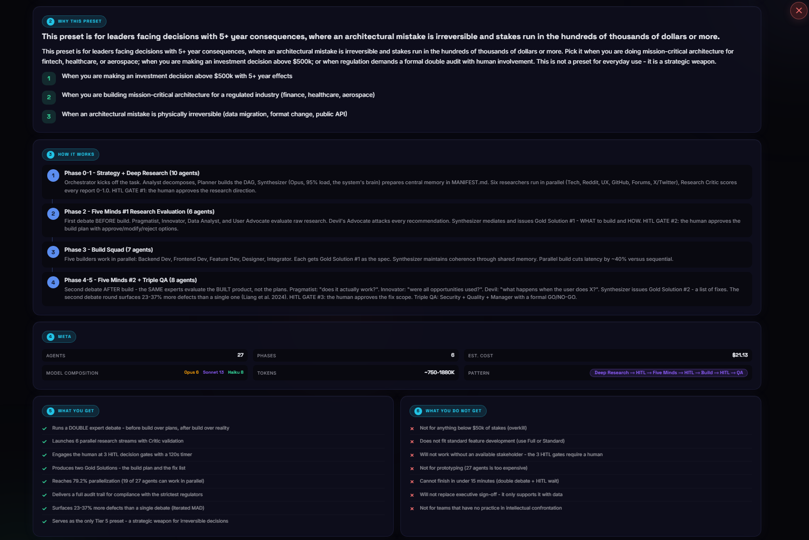
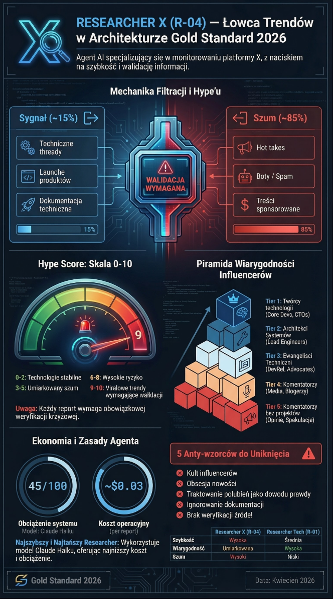
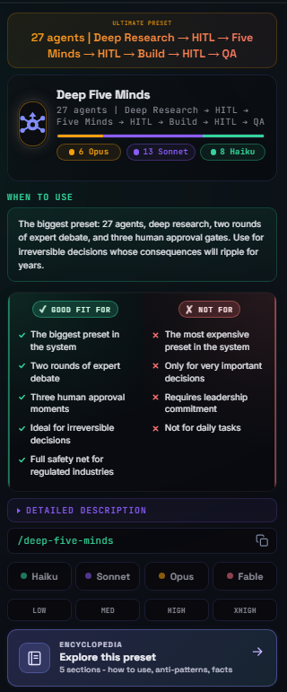
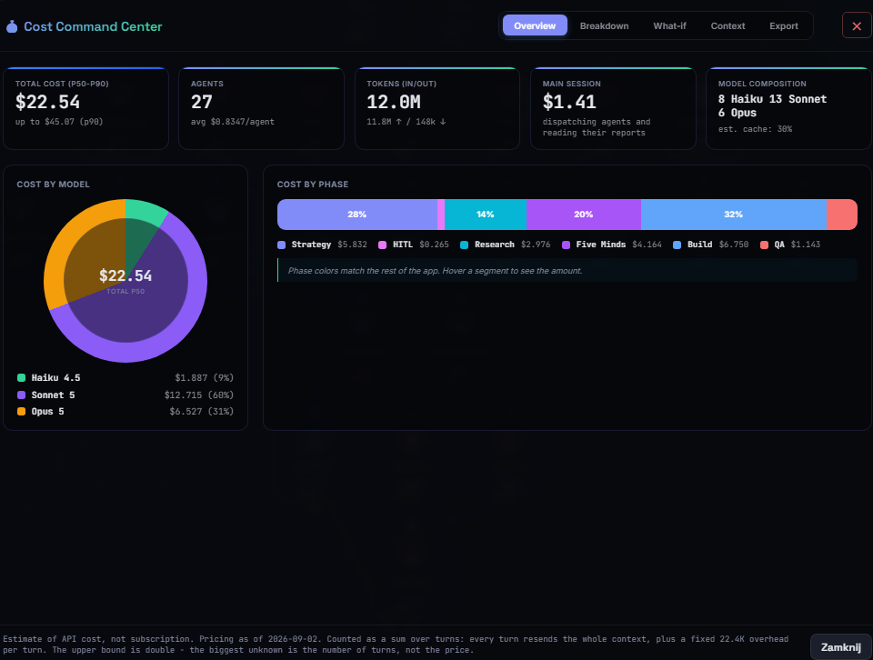
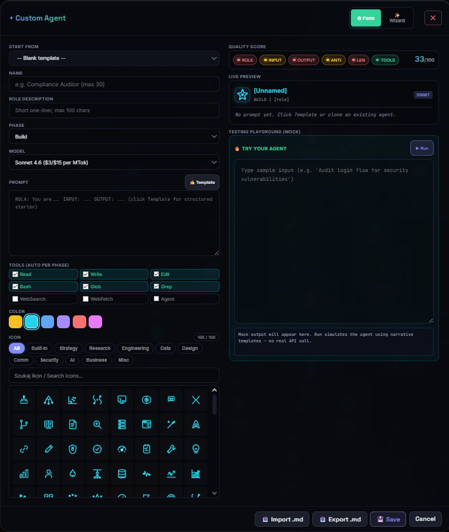
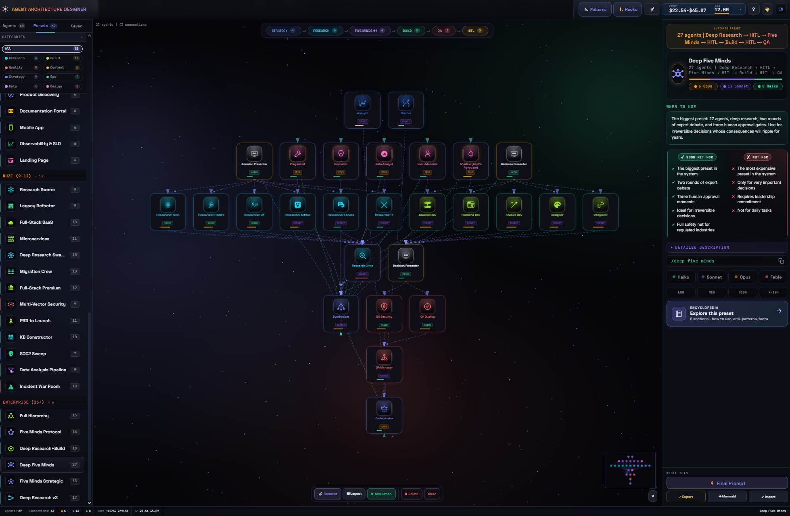
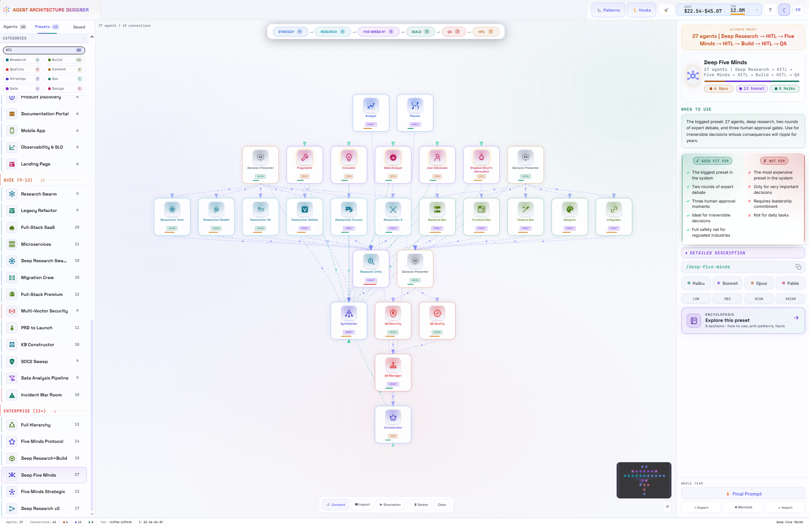
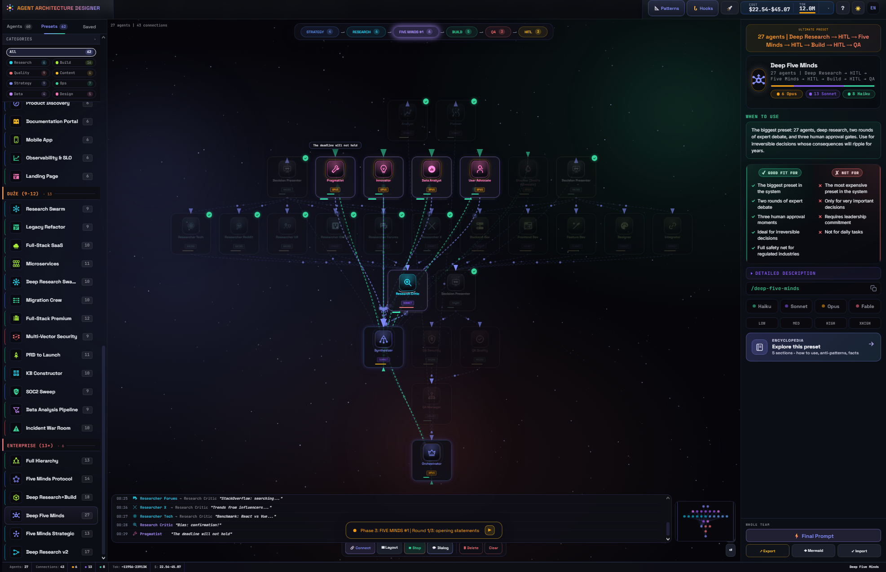

# Agent Architecture Designer

> If Claude Code is the engine, Agent Architecture Designer is the dashboard - design the team, watch it work before you spend a single token, then export exactly what Claude Code needs to run it for real.

<p align="center">
  
</p>

<p align="center">
  <a href="https://github.com/TheJacksonCode/Agent-Architecture/blob/master/LICENSE"></a>
  <a href="https://thejacksoncode.github.io/Agent-Architecture/"></a>
  
  
  
  
  
</p>

---

## Why this exists

Agent Architecture Designer is **primarily an educational and developmental tool**. It is not a production orchestrator - it is a place where you can slow down and study multi-agent systems the way you would study a complex machine: one moving part at a time.

The goal is that after using it, you should be able to:

- **Understand what every single agent actually does** - its role, inputs, outputs, anti-patterns, and failure modes
- **Understand how agents talk to each other** - who hands off to whom, which phases they live in, where the friction is
- **Understand why a given preset looks the way it does** - why it has 6 agents and not 12, why a Five Minds debate sits in the middle, why the HITL gate lives where it lives
- **Recognize the architecture patterns behind the scenes** - ReAct, Orchestrator-Worker, Blackboard, Routing, and seven others, with real examples pulled from the agents on the canvas
- **Understand exactly when Claude Code will run your own hooks**, across all 27 documented lifecycle events, before you write a single line of hook config
- **Understand the cost and context budget of a multi-agent system** before you ever spend a token

You can use it as a visual designer, but the real value is the **Encyclopedia** behind every agent and every preset. Each entry is structured like a short lesson: who it is, how it works in phases, what it does, what it does NOT do, anti-patterns, real-world examples, when it fails, and fun facts.

## What's new in v41

The project has grown a lot since the first public release (v32, still available at [`v32/`](v32/)). Between v33 and v41 it went from 35 agents / 42 presets to **60 agents / 62 presets**, and three new teaching modules were added on top of the original canvas + encyclopedia:

- **Guided tutorial** - a 5-step in-app tour that lights up one UI element at a time, auto-starts on first visit, fully bilingual. Entry point: the flashlight icon in the header.
- **Hooks Playground** - an interactive map of all **27 Claude Code lifecycle hook events** across 4 lanes (session / turn / tool / async), with cadence, trigger, matcher syntax, and blocking behavior for each one.
- **Architecture Patterns** - a reference for **10 canonical multi-agent patterns** (ReAct, Prompt Chaining, Orchestrator-Worker, Routing, Map-Reduce, Reflection, Debate/Ensemble, Human-in-the-Loop, Blackboard, Guardrails), each one linked back to the real agents on the canvas that implement it.

Plus a full pass on performance (smoother canvas dragging and panning, a faster encyclopedia scroll) and accessibility (WCAG-aligned contrast, focus order, and target sizes across the header and canvas controls). See [Versioning](#versioning) below for the version-by-version story.

## What you can do with it

1. **Learn**. Click any of the 60 agents or 62 presets and read a full encyclopedia entry. This is the main use case.
2. **Design**. Drag agents onto a canvas, connect them, assign models (Opus / Sonnet / Haiku / Fable), and generate a ready-to-use system prompt for Claude Code.
3. **Simulate**. Run a live simulation where agents exchange animated messages and pass through HITL decision gates, so you can see the flow before you commit to it.
4. **Budget**. Open the Cost Command Center to see per-agent / per-phase cost estimates, context window pressure, and what-if scenarios (all Opus, all Sonnet, all Haiku).
5. **Study the hooks system**. Open Hooks and scan all 27 lifecycle events without touching a settings file.
6. **Study the patterns behind the agents**. Open Patterns and see which of the 10 canonical multi-agent architectures each preset is actually built from.
7. **Export**. Copy a system prompt, a Mermaid diagram of the team, a Markdown report, CSV, or JSON.

No installation. No npm. No build step. It is a **single HTML file** that works offline.

## Languages - Polish and English

The interface is fully bilingual with a one-click language toggle. **Polish is more comprehensive than English** - because the author is Polish and because a larger Polish knowledge base was available during research. Specifically:

- All 60 agent + 62 preset encyclopedia entries exist in both languages
- The Hooks and Patterns modules are fully bilingual, including every hook's cadence/trigger/matcher description
- The Polish version ships with **inline infographics** for a handful of pilot agents, rendered directly in the encyclopedia bento - the English version does not have them yet
- Polish is the default authoring language; English translations are technical/direct US English with no em/en-dashes

If you are an English-speaking user and feel something is missing, please open an issue - we want to know which parts you would like to see expanded.

## Live demo

[**Open Agent Architecture Designer**](https://thejacksoncode.github.io/Agent-Architecture/) on GitHub Pages.

Start with the preset **Deep Five Minds** for the full experience (27 agents, two Five Minds debates, three HITL gates), click any agent to open its encyclopedia, then press **Simulation** to watch the team run.

## Key features

- **Visual canvas** - drag and drop 60 agents, draw connections, marquee-select groups, auto-place with smart suggestions, right-click context menu
- **Agent encyclopedia** - every one of the 60 agents and 62 presets has a bento-grid entry: who I am, analogy, how I work (phase-by-phase), what I do, what I do NOT do, real-world scenario, when I fail, facts, deep dive, team composition
- **Preset encyclopedia** - every one of the 62 presets has a dual-column green-light / red-light verdict panel, a phase-flow bar (agent count per phase, in every preset), and an agent roster with model hints
- **Guided tutorial** - 5-step interactive tour, auto-starts on first visit, PL/EN
- **Hooks Playground** - all 27 Claude Code lifecycle events across 4 lanes, cadence/trigger/matcher/blocking behavior for each
- **Architecture Patterns** - 10 canonical multi-agent patterns, each tied to real agents and presets on the canvas
- **Five Minds Protocol** - structured adversarial debate with 4 domain experts + a Devil's Advocate ("Shadow") producing a Gold Solution
- **HITL decision gates** - human checkpoints between phases, countdown, auto-decide fallback, Decision Presenter agent
- **Live simulation** - agents exchange animated speech bubbles and data packets along their connections; Dialog Timeline logs everything
- **Mission Control** - fullscreen cinematic simulation dashboard with real-time metrics, phase timeline, and communications log
- **Cost Command Center** - per-agent / per-phase cost estimates, context window usage, model mix, what-if sliders, export to Markdown / CSV / JSON
- **Custom Agent Creator Pro** - 7-feature builder (clone, live preview with quality score, icon picker, color swatches, MD export/import, wizard mode, mock testing playground)
- **Dark / Light theme** - complete CSS variable system, contrast-aware ink tokens, color-vision-safe phase palette
- **Bilingual PL/EN** - every UI string, every encyclopedia entry, every cost modal label, every hook and pattern
- **Accessibility** - WCAG-aligned contrast and target sizes, keyboard navigation, focus-visible, skip link, reduced-motion support
- **Zero dependencies** - no npm, no CDN, no build step. One HTML file

## What lives on the canvas

### 60 agents

| Category | Agents | Model mix |
|----------|--------|-----------|
| **Orchestration & Strategy** | Orchestrator, Synthesizer, Synthesizer Lean, Decision Advisor | Opus for orchestration, Sonnet for synthesis |
| **Planning** | Analyst, Planner | Sonnet |
| **Research** | Researcher Tech, UX, Reddit, X, GitHub, Forums, Docs, Research Critic, Extractor, Recipe Scout | Haiku for scanning, Sonnet for synthesis-heavy roles |
| **Build** | Backend Dev, Frontend Dev, Feature Dev, Designer, Integrator, Writer, DB Architect, Observability Engineer, Mobile Developer, Technical Writer + 7 more (voice, career, content, and recipe specialists) | Sonnet, with Haiku for lightweight guardians |
| **QA / Audit** | QA Security, QA Quality, QA Performance, QA Manager, Accessibility Tester | Haiku for the light checks, Sonnet for QA Manager |
| **Five Minds** | Pragmatist, Innovator, Data Analyst, User Advocate, Shadow (Devil's Advocate) | Opus |
| **HITL** | Decision Presenter | Haiku |
| **Data & AI** | ML Engineer, Data Engineer, AI Engineer, Prompt Engineer, Statistician, EDA Analyst | Sonnet |
| **Infra / Ops** | DevOps Engineer, Cloud Architect, SRE Engineer, Kubernetes Specialist, Telemetry Surfer | Sonnet |
| **Product** | Product Manager, UX Researcher, GTM Strategist | Sonnet |
| **Compliance** | Control Mapper | Sonnet |

Across the full catalog: **42 Sonnet, 11 Haiku, 7 Opus** - Fable is available as a fourth model tier but has no default assignment yet.

Every agent ships with a research-backed prompt following ROLE / INPUT / OUTPUT / RESPONSIBILITIES / RULES / ANTI-PATTERNS / WHAT YOU DO NOT DO / REPORT FORMAT. Prompts are self-contained so an isolated subagent can execute without additional context. See [`docs/SKILLS_ARCHITECTURE.md`](docs/SKILLS_ARCHITECTURE.md) for the full format.

### 62 presets, grouped by size

- **Minimal (2-3 agents, 7 presets)** - Solo + Validator, Quick Fix, Recon Squad, Classic Trio, Reflective Loop, Voice, Master Chef
- **Core (4-6 agents, 28 presets)** - Bug Hunter, Content Pipeline, Plan & Execute, Performance Boost, Content Social, Career, Decision Research, Accessibility Audit, Codebase Onboarding, Growth Campaign, Pitch Deck, Startup MVP, Cascade Cost, Testing Suite, Accessibility Sprint, MLOps Pipeline, RAG / AI App Build, DevOps CI/CD Setup, Cloud / K8s Deploy, Product Discovery, Documentation Portal, Mobile App, Observability & SLO, Landing Page, Security Hardening, Code Review, Design System, API Modernization
- **Advanced (7-11 agents, 20 presets)** - UI/UX Overhaul, Feature Sprint, A/B Test Lab, Bento Redesign, Standard Dev, Data Pipeline, Performance Squad, Tech Writing Pipeline, Research Swarm, Legacy Refactor, Multi-Vector Security, SOC2 Sweep, Data Analysis Pipeline, Full-Stack SaaS, Deep Research Swarm Pro, Migration Crew, KB Constructor, Incident War Room, Microservices, PRD to Launch
- **Enterprise / flagship (12-27 agents, 7 presets)** - Full-Stack Premium, Full Hierarchy, Five Minds Strategic, Five Minds Protocol, Deep Research v2, Deep Research+Build, and the flagship **Deep Five Minds** (27 agents, 2 Five Minds debates, 3 HITL gates)

## Hooks Playground

Claude Code exposes 27 lifecycle hook events, grouped into 4 lanes:

| Lane | What it covers | Example events |
|------|-----------------|-----------------|
| **Session** | Once per session | `SessionStart`, `SessionEnd` |
| **Turn** | Once per assistant turn | `UserPromptSubmit`, `Stop`, `StopFailure` |
| **Tool** | Per tool call | `PreToolUse`, `PostToolUse`, `PostToolUseFailure` |
| **Async** | Alongside the main flow | background/notification-style events |

For each of the 27 events, the Playground shows cadence, exact trigger condition, matcher syntax (tool name patterns, `startup|resume|clear|compact`, etc.), whether it can block execution, and typical uses (inject context, redact secrets, block a dangerous command, enforce "keep working until tests pass", flush metrics on exit). Nothing here is invented - it mirrors Claude Code's actual hook contract.

## Architecture Patterns

A reference card for the 10 patterns that show up again and again in multi-agent systems:

**ReAct** - **Prompt Chaining** - **Orchestrator-Worker** - **Routing** - **Map-Reduce** - **Reflection** - **Debate (Ensemble)** - **Human-in-the-Loop** - **Blackboard** - **Guardrails**

Each pattern entry explains the idea, when to reach for it, when NOT to, and which agents/presets on the canvas actually implement it - so instead of a textbook diagram, you get a working example one click away.

## Screenshots

> **Note:** the screenshots below are from the v32 encyclopedia and cost center - they still represent the core UI accurately, but do not yet show the v41-only modules (Hooks Playground, Architecture Patterns, guided tutorial, phase-flow bar). A v41 screenshot refresh is planned.

### Agent encyclopedia (bento layout)


### Inline infographics (Polish encyclopedia)


### Preset verdict panel (green / red)


### Cost Command Center


### Custom Agent Creator Pro


### Canvas (dark and light themes)
 

### Live simulation


## Claude Code integration

Agent Architecture Designer includes a complete orchestration layer: **60 agent skills**, **62 team presets**, and a routing catalog that work directly inside Claude Code.

**Full walkthrough:** [INSTALL.md](INSTALL.md) - covers installation, updating after a new version, troubleshooting, and how to add your own agent to the catalog.

### Quick start

```bash
git clone https://github.com/TheJacksonCode/Agent-Architecture.git
cd Agent-Architecture

# 1. Generate agent skills (60 files -> ~/.claude/skills/)
node generate_skills.js

# 2. Generate team presets (62 files -> ~/.claude/commands/)
node generate_commands.js

# 3. (optional) Generate the routing catalog, for task-description auto-routing
node generate_catalog.js
```

Once generated, presets are **global** - they work in every project, not just this repo. Steps 1-2
are enough for explicit `/preset-name` commands; step 3 adds the routing snippet you paste into
your own `~/.claude/CLAUDE.md` to unlock auto-routing (details in [INSTALL.md](INSTALL.md)).

### Using presets

Type `/` in Claude Code and pick a preset, or describe your task and let Claude auto-route to the best one:

| Tier | Example presets | Agents |
|------|----------------|--------|
| Minimal | `/solo`, `/quick-fix`, `/trio` | 2-3 |
| Core | `/bug-hunt`, `/test-suite`, `/startup` | 4-6 |
| Advanced | `/security`, `/design-sys`, `/research` | 7-11 |
| Enterprise | `/saas`, `/full`, `/five-minds`, `/deep-five-minds` | 12-27 |

Each preset orchestrates a team of agents across phases (Strategy -> Research -> Build -> QA -> HITL) with decision gates between them. See [`docs/ROUTING_SYSTEM.md`](docs/ROUTING_SYSTEM.md) for the full catalog and auto-routing architecture.

### Architecture

```
~/.claude/skills/*.md        # 60 agent prompts (single source of truth)
~/.claude/commands/*.md      # 62 preset files (reference skills, not duplicate them)
~/.claude/PRESET_CATALOG.md  # Routing catalog (task -> best preset)
generate_skills.js           # Regenerate skills from HTML source (v41)
generate_commands.js         # Regenerate commands from HTML source (v41)
generate_catalog.js          # Regenerate the routing catalog from HTML source (v41)
```

See [`docs/SKILLS_ARCHITECTURE.md`](docs/SKILLS_ARCHITECTURE.md) for the full skill format, model routing, and how to add new agents.

## Technical details

- **Format** - single HTML file, ~7.1 MB (includes all encyclopedia content in PL + EN, inline SVG icons, inline infographics for pilot agents)
- **Dependencies** - zero. No npm, no CDN, no build step
- **Stack** - Vanilla JS (ES2022) + inline SVG + CSS transitions + Canvas 2D + container queries
- **State** - localStorage persistence (canvas, theme, icon mode, language preference, custom agents), with a versioned migration chain
- **Rendering** - hybrid architecture: Canvas 2D for particles/starfield, SVG for connections and icons, CSS transforms for agent-node dragging (rAF-batched, layout-free)
- **Accessibility** - WCAG-aligned contrast and target sizes, focus-visible, prefers-reduced-motion, keyboard navigation, skip link
- **Models** - Opus 5 ($5/$25 per MTok in/out) for orchestration and debate, Sonnet 5 ($2/$10) for most agents, Haiku 4.5 ($1/$5) for light research and HITL gating, Fable 5.1 ($10/$50) available as a fourth tier
- **Security** - HTML-escaping sweep across all `innerHTML` sinks, CSV formula-injection guard, Mermaid label sanitization, safe localStorage read/write with quota handling
- **Bilingual engine** - flat `I18N_EN.ui` lookup plus dedicated namespaces for the encyclopedia, Hooks Playground, and Architecture Patterns modules

## Versioning

Each major version is saved in its own folder as a single HTML file. `v32/` was the first public release; `v41/` is the current one and the one the root `index.html` mirrors for GitHub Pages. Development versions between the two (v33-v40) stay local - only the published milestones are pushed.

See [VERSIONS.md](VERSIONS.md) for the detailed v1-v32 changelog.

### Version highlights, v32 to v41

| Version | Key addition |
|---------|---------------|
| v32 | First public release - 35 agents, 42 presets, full bilingual encyclopedia, Cost Command Center, Custom Agent Creator Pro |
| v33 | Scope widened beyond software tasks - research, career, and lifestyle presets added alongside the original dev-focused catalog |
| v34 | **Hooks Playground** shipped - all 27 Claude Code lifecycle events, effort-per-agent as a second routing dimension, larger Data & AI / Infra agent roster |
| v35 | Accessibility and Product agent categories added; catalog grows to 58 agents / 55 presets |
| v36 | Canvas node polish - uniform node sizing across the board, category-based color coding |
| v37 | Preset icon set, right-panel cleanup, token pricing filled in for every agent |
| v38 | Stabilization pass - held as the working baseline before the Patterns module build |
| v39 | Hooks Playground finalized and approved; frozen as a fallback build |
| v40 | **Architecture Patterns** module shipped - 10 canonical multi-agent patterns, each linked to real agents and presets |
| **v41** | **Guided tutorial** (5-step in-app tour), full cosmetics and accessibility pass, canvas and encyclopedia performance tuning, catalog reaches **60 agents / 62 presets** |

## Feedback

This project is still growing and **we actively want your feedback** - especially on the educational side:

- Did the encyclopedia help you understand a specific agent you were confused about? Which one?
- Is there an agent role or pattern missing from the 60 / 62 catalog?
- Do you want infographics in the English version too?
- Did the Hooks Playground or Architecture Patterns module change how you think about your own Claude Code setup?

Please open a [GitHub issue](https://github.com/TheJacksonCode/Agent-Architecture/issues) or start a [discussion](https://github.com/TheJacksonCode/Agent-Architecture/discussions). Short comments and screenshots are very welcome.

## License

[MIT](LICENSE) - Copyright (c) 2026 TheJacksonCode

## Author

Built by **[TheJacksonCode](https://github.com/TheJacksonCode)**.

---

<sub>Interface languages: Polish (more comprehensive, with pilot inline infographics) and English (full parity for the core encyclopedia, Hooks, and Patterns modules) | Documentation language: English | Primary purpose: education and development - understanding how multi-agent systems think</sub>
